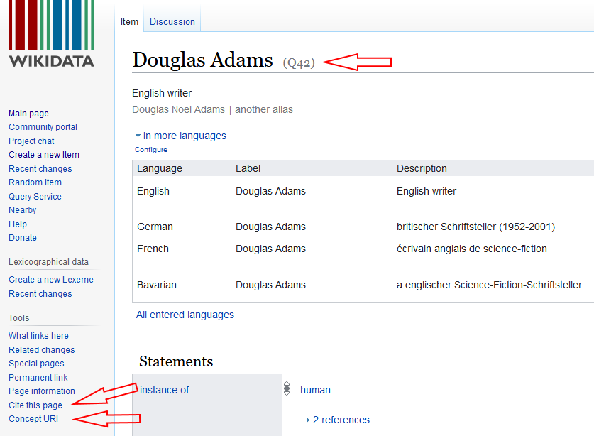

<!-- .element class="aligned-center title-page" -->
# Wikidata und SPARQL

Anfragen an Graph-Datenbanken anhand der Wikidata-Schnittstelle

—

Martin Scholz, UB Erlangen-Nürnberg, 2023-07-21
<!-- .element class="small" -->

http://github.com/mnscholz/wikidata-sparql-tutorial/


**⇨ Wikidata**

SPARQL

Demo


> Wikidata ist eine freie Wissensdatenbank, die sowohl von Menschen als auch von Maschinen gelesen und bearbeitet werden kann. 

https://www.wikidata.org


## Datenmodell


https://de.wikipedia.org/wiki/Wikidata


## Wissensnetz und Wissens-Hub

Grundlegende Datenstruktur ist ein Netzwerk / Graph:
- Entitäten: Instanzen, Klassen
- Eigenschaften
- Tripel
- offenes Schema

Features:
- Qualifikatoren
- fremde Identifikatoren
- Wikimedia-Querverweise


## Wie Wikidata nutzen?

- als Normdatei

- als Datenquelle

- als Datensenke


## Wikidata als Normdatei

<div>

</div>
<!-- .element class="image-on-left" style="width: 50%;" -->

<div>

<br>
Manuelle Verweise über Identifikatoren:
- Q-Nummer: fortlaufende Nummer
- URI: Linked Data
- persistente URL: Zitation
</div>
<!-- .element class="content-on-right" style="width: 46%;" -->


## Wikidata als Datenquelle

- Fächerübergreifend, "Generalist"
- Aggregator/Hub
- ⚠ Daten eventuell lückenhaft!

- - -

Daten stehen in unterschiedlicher Form bereit:

- [Dump](https://www.wikidata.org/wiki/Wikidata:Database_download)
- [Linked Open Data (JSON, RDF, etc.)](https://www.wikidata.org/wiki/Wikidata:Data_access#Linked_Data_Interface_(URI))
- [Sparql-Endpoint](https://query.wikidata.org)


## Wikidata als Datensenke

Möglichkeiten:
- Manuelle Bearbeitung einzelner Entities
- Manuelles Anlegen neuer Entities
- Ingest größerer Datenmengen möglich 

Zu beachten:
- Relevanzregeln
- Gesperrte Entitites
- Absprache mit Wikidata-Team (Ingest)


## Links 

- [Wikidata](https://www.wikidata.org)
- [Sparql Endpoint](https://query.wikidata.org/)

- - -

- [Zugriff auf Daten](https://www.wikidata.org/wiki/Wikidata:Data_access/de)
- [Eingabe/Upload von Daten](https://www.wikidata.org/wiki/Wikidata:Data_donation/de)
- [Übersicht zu Wikidata-Werkzeugen](https://www.wikidata.org/wiki/Wikidata:Tools)

- - -

Tutorials (PDF):
- [Wikidata -- Gentle Introduction for Complete Beginners](https://upload.wikimedia.org/wikipedia/commons/5/5c/Wikidata_-_A_Gentle_Introduction_for_Complete_Beginners_%28Estonia_2017%29.pdf)
- [An Ambitious Wikidata Tutorial](https://upload.wikimedia.org/wikipedia/commons/3/3f/An_Ambitious_Wikidata_Tutorial.pdf)
- [Studon-Kurs zu Sparql mit Wikidata als Anwendungsbeispiel](https://www.studon.fau.de/pg570378_2798870.html) (nur mit Anmeldung)


Wikidata

**⇨ SPARQL**

Demo


> Simple *Protocol* And RDF Query *Language*


https://www.w3.org/TR/sparql11-query/

- - -

- Anfrage-Sprache und -Protokoll für Graph-Datenbanken.
- Bekannteste Alternative ist [GraphQL](https://graphql.org/).
- *Endpoint*: Eine über das Web ansprechbare Sparql-Schnittstelle


## RDF = Resource Description Framework

- W3C-Standard zur Repräsentation von Daten als Graph / Netzwerk / Triples / SPO-Aussagen

- Linked Data: Global / Webbasiert; URIs als Identifikatoren

- kein festes Schema: offen, flexibel, ... chaotisch


## Endpoints in the Wild

verschiedenste Datenbestände als RDF / mit Sparql anfragbar, z.B.:

- [Wikidata](https://query.wikidata.org/): Daten für Wikipedia
- [data.europa.eu](https://data.europa.eu/data/sparql): Daten zu Europa
- [Getty Vocabularies](http://vocab.getty.edu/sparql): Normdaten
- [LinkedGeoData.org](http://linkedgeodata.org/sparql): OpenStreetMap
- ...

⚠ Leider häufig nicht sehr beständig!
(Der Hype ist vorbei...)


## Aufbau einer Sparql-Anfrage

```
PREFIX rdf: <http://www.w3.org/1999/02/22-rdf-syntax-ns#>
SELECT ?a ?b ?c
WHERE {
  ?a rdf:type <http://example.org/class> .
  ?a ?b ?c .
  FILTER (contains(STR(?c), 'bla'))
}
LIMIT 100
``` 

4 Anfrage-Typen; `SELECT` ist der wichtigste.


>>>

## Aufbau einer Sparql-Anfrage

```
PREFIX rdf: <http://www.w3.org/1999/02/22-rdf-syntax-ns#>
```
Namensraum / "Abkürzung für lange URIs"
```
SELECT ?a ?b ?c
WHERE {
  ?a rdf:type <http://example.org/class> .
  ?a ?b ?c .
  FILTER (contains(STR(?c), 'bla'))
}
LIMIT 100
```

>>>

## Aufbau einer Sparql-Anfrage

```
PREFIX rdf: <http://www.w3.org/1999/02/22-rdf-syntax-ns#>
SELECT ?a ?b ?c
```
Gesuchte Variablen / Spalten der Ergebnisliste
```
WHERE {
  ?a rdf:type <http://example.org/class> .
  ?a ?b ?c .
  FILTER (contains(STR(?c), 'bla'))
}
LIMIT 100
```


>>>

## Aufbau einer Sparql-Anfrage

```
PREFIX rdf: <http://www.w3.org/1999/02/22-rdf-syntax-ns#>
SELECT ?a ?b ?c
WHERE {
```
ab hier beginnt die zu suchende Graphstruktur
```
  ?a rdf:type <http://example.org/class> .
  ?a ?b ?c .
  FILTER (contains(STR(?c), 'bla'))
}
LIMIT 100
```


>>>

## Aufbau einer Sparql-Anfrage

```
PREFIX rdf: <http://www.w3.org/1999/02/22-rdf-syntax-ns#>
SELECT ?a ?b ?c
WHERE {
  ?a rdf:type <http://example.org/class> .
```
ein Triple-Pattern/-Muster; immer S P O

```
  ?a ?b ?c .
  FILTER (contains(STR(?c), 'bla'))
}
LIMIT 100
```


>>>

## Aufbau einer Sparql-Anfrage

```
PREFIX rdf: <http://www.w3.org/1999/02/22-rdf-syntax-ns#>
SELECT ?a ?b ?c
WHERE {
  ?a rdf:type <http://example.org/class> .
  ?a ?b ?c .
```
?a wird durch obiges Tripel-Pattern eingeschränkt
```
  FILTER (contains(STR(?c), 'bla'))
}
LIMIT 100
```


>>>

## Aufbau einer Sparql-Anfrage

```
PREFIX rdf: <http://www.w3.org/1999/02/22-rdf-syntax-ns#>
SELECT ?a ?b ?c
WHERE {
  ?a rdf:type <http://example.org/class> .
  ?a ?b ?c .
  FILTER (contains(STR(?c), 'bla'))
```
Einschränkung, die nicht die Graphstruktur betrifft
```
}
LIMIT 100
```


>>>

## Aufbau einer Sparql-Anfrage

```
PREFIX rdf: <http://www.w3.org/1999/02/22-rdf-syntax-ns#>
SELECT ?a ?b ?c
WHERE {
  ?a rdf:type <http://example.org/class> .
  ?a ?b ?c .
  FILTER (contains(STR(?c), 'bla'))
}
LIMIT 100
```
Beschränke Ergebnis auf die ersten 100 Treffer


>>>

## Aufbau einer Sparql-Anfrage

```
PREFIX rdf: <http://www.w3.org/1999/02/22-rdf-syntax-ns#>
SELECT ?a ?b ?c ?e
WHERE {
  ?a rdf:type <http://example.org/class> .
  ?a ?b ?c .
  FILTER (contains(STR(?c), 'bla'))
  OPTIONAL {
    ?c ?d ?e .
  }
```
optional vorhandene Struktur und Datenpunkte
```
}
LIMIT 100
```


>>>

## Aufbau einer Sparql-Anfrage

```
PREFIX rdf: <http://www.w3.org/1999/02/22-rdf-syntax-ns#>
SELECT ?a ?b ?c ?e
WHERE {
  ?a rdf:type <http://example.org/class> ;
     ?b ?c ;
     ?d ?e, <http://example.org/class> .
```
verkürzende Syntax für Triples mit gleichem Anfang
```
  FILTER (contains(STR(?c), 'bla'))
}
LIMIT 100
```


## Automatisiert anfragen

Sparql-Endpoints benutzen sog. REST-API ("normale" Webseitenanfragen)

- Anfrage:
  - Anfrage an URL des Endpoints anhängen

- Ergebnis:
  - Standardformat ist XML
  - viele Endpoints unterstützen weitere Formate wie CSV, HTML-Tabellen, etc.


## Anfrage als URL

https://query.wikidata.org/sparql?query=SELECT%20*%20WHERE%20%7B%20%3Fa%20%3Fb%20%3Fc.%20%7D%20LIMIT%2010

- - - 

Auf der Kommandozeile:

```
curl -L 'https://query.wikidata.org/sparql?query=SELECT%20%3Fpic%20%3Fitem%20%3FcreatorLabel%20%3FitemLabel%20(YEAR(%3Fdate)%20as%20%3Fyear)%20%3Fedate%20%3Fldate%20%3Finv%20%3FmatLabel%20%3FgenreLabel%20%3FlocLabel%20%3Fpic_reified%20%3Fpicy%20%3Fpicz%0AWHERE%0A%7B%0A%3Fitem%20wdt%3AP180%20wd%3AQ154326%3B%0A%20%20%20%20%20%20%0Aoptional%20%7B%20%3Fitem%20wdt%3AP170%20%3Fcreator.%7D%0Aoptional%20%7B%20%3Fitem%20wdt%3AP571%20%3Fdate.%7D%0Aoptional%20%7B%20%3Fitem%20wdt%3AP1319%20%3Fedate.%20%7D%0Aoptional%20%7B%20%3Fitem%20wdt%3AP1326%20%3Fldate.%20%7D%0Aoptional%20%7B%20%3Fitem%20wdt%3AP18%20%3Fpic.%7D%0Aoptional%20%7B%20%3Fitem%20wdt%3AP217%20%3Finv.%7D%0Aoptional%20%7B%20%3Fitem%20wdt%3AP186%20%3Fmat.%7D%0Aoptional%20%7B%20%3Fitem%20wdt%3AP136%20%3Fgenre.%7D%0Aoptional%20%7B%20%3Fitem%20wdt%3AP276%20%3Floc.%20%7D%0Aoptional%20%7B%20%3Fitem%20wdt%3AP18%20%3Fpic_reified.%0A%20%20%20%20%20%20%20%20%20%3Fpic_reified%20%3Fpicy%20%3Fpicz.%20%7D%0A%20%20%0ASERVICE%20wikibase%3Alabel%20%7B%20bd%3AserviceParam%20wikibase%3Alanguage%20%22en%2C%5BAUTOLANGUAGE%5D%22%20%7D%0A%7D%0AORDER%20BY%20%3Fyear%0A' > query.xml
```


## Anfrageergebnis in XML

```
<?xml version='1.0' encoding='UTF-8'?>
<sparql xmlns='http://www.w3.org/2005/sparql-results#'>
	<head>
		<variable name='a'/>
		<variable name='b'/>
		<variable name='c'/>
	</head>
	<results>
		<result>
			<binding name='a'>
				<uri>http://wikiba.se/ontology#Dump</uri>
			</binding>
			<binding name='b'>
				<uri>http://creativecommons.org/ns#license</uri>
			</binding>
			<binding name='c'>
				<uri>http://creativecommons.org/publicdomain/zero/1.0/</uri>
			</binding>
		</result>
```


## Weiterverarbeitung auf der Kommandozeile / per Skript

```
curl -L 'https://query.wikidata.org/sparql?query=SELECT%20%3Fpic%20%3Fitem%20%3FcreatorLabel%20%3FitemLabel%20(YEAR(%3Fdate)%20as%20%3Fyear)%20%3Fedate%20%3Fldate%20%3Finv%20%3FmatLabel%20%3FgenreLabel%20%3FlocLabel%20%3Fpic_reified%20%3Fpicy%20%3Fpicz%0AWHERE%0A%7B%0A%3Fitem%20wdt%3AP180%20wd%3AQ154326%3B%0A%20%20%20%20%20%20%0Aoptional%20%7B%20%3Fitem%20wdt%3AP170%20%3Fcreator.%7D%0Aoptional%20%7B%20%3Fitem%20wdt%3AP571%20%3Fdate.%7D%0Aoptional%20%7B%20%3Fitem%20wdt%3AP1319%20%3Fedate.%20%7D%0Aoptional%20%7B%20%3Fitem%20wdt%3AP1326%20%3Fldate.%20%7D%0Aoptional%20%7B%20%3Fitem%20wdt%3AP18%20%3Fpic.%7D%0Aoptional%20%7B%20%3Fitem%20wdt%3AP217%20%3Finv.%7D%0Aoptional%20%7B%20%3Fitem%20wdt%3AP186%20%3Fmat.%7D%0Aoptional%20%7B%20%3Fitem%20wdt%3AP136%20%3Fgenre.%7D%0Aoptional%20%7B%20%3Fitem%20wdt%3AP276%20%3Floc.%20%7D%0Aoptional%20%7B%20%3Fitem%20wdt%3AP18%20%3Fpic_reified.%0A%20%20%20%20%20%20%20%20%20%3Fpic_reified%20%3Fpicy%20%3Fpicz.%20%7D%0A%20%20%0ASERVICE%20wikibase%3Alabel%20%7B%20bd%3AserviceParam%20wikibase%3Alanguage%20%22en%2C%5BAUTOLANGUAGE%5D%22%20%7D%0A%7D%0AORDER%20BY%20%3Fyear%0A' | 
xmlstarlet sel -T -t -m "//*[@name='item']" -v 'substring-after(*, "entity/")' -o ':' -v "../*[@name='pic']/*" -o ';' -n > entities_pics.txt
```


## Fortgeschrittene Features

- Graph-Selektion: `FROM ...` und `GRAPH ?g { }`

- Property Chains: `?company wdt:P159/wdt:P131* ?state`

- Gruppierung und Sortierung: `GROUP BY ...` und `ORDER BY ...`

- Federated Query: `SERVICE <> { }`


Wikidata

SPARQL

**⇨ Demo**


## Wikidatas Sparql Query Builder

- Zusammenklicken von einfachen Anfragen

- Autovervollständigung und Suchassistenten

- Beispiele mit komplizierten Anfragen

=> Learning by doing

⚠ Wikidata-Endpoint und -GUI benutzen Sparql-Erweiterungen bzw. bereiten die Antworten auf!

https://query.wikidata.org/


